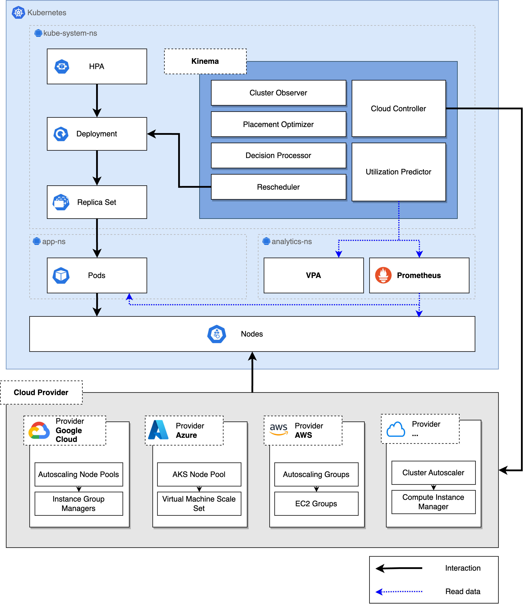
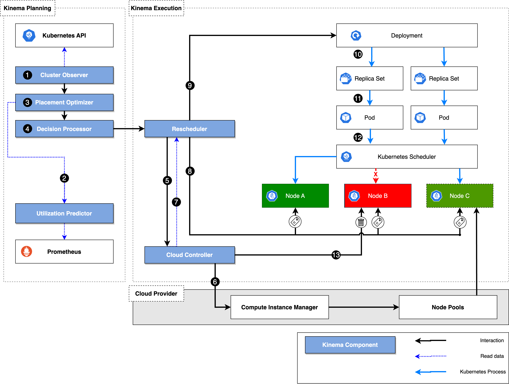

# KINEMA - Resource aware pod rescheduling in Kubernetes

Kinema is a sophisticated Kubernetes rescheduling system optimizing resource management by considering cluster state, predictive resource utilization, and cloud vendor pricing for intelligent decisions on node configuration and pod placement, achieving significant gains in cost reduction and resource utilization improvement.

Demo: 
 

## Architecture 

At the core, Kinema has access to all workload placements in the cluster by leveraging the Kubernetes API. The system itself runs as a system-critical pod within the kube system namespace.
Apart from access to the current mapping of workloads onto nodes, the system also has access to current resource utilization that Prometheus actively scrapes. The resource utilization for each workload is provided by the daemon set cAdvisor, which monitors various parameters of the running containers. Additionally, current resource recommendations can be calculated using the available data from Prometheus and the VPA.
Kinema leverages an internal cloud controller to access the underlying cloud infrastructure seamlessly, granting comprehensive insights into available compute configurations and their corresponding pricing details. At present, Google Cloud is fully supported as a trusted cloud provider. However, owing to the cloud controllers’ highly modular nature and architecture, expanding compatibility with other platforms is readily achievable.
By combining the knowledge of current workload mappings, resource utilization, and available compute resources offered by the cloud provider, the current best configuration workload and node configuration for the cluster can be calculated and finally put into action using a rescheduling approach. This approach relies on well-established Kubernetes techniques, specifically rolling updates. These updates are performed with configurable maximum unavailability of services, guaranteeing no disruptions. This methodology maintains service continuity throughout the update process, ensuring a seamless transition without any negative impact on user experience.  

## Rescheduling Approach  

The Kinema process can be divided into the planning and the execution phase as presented in the graphic above.
The cluster observer (1) utilizes the Kubernetes API to store a local state of the cluster and is responsible for initiating and managing the current state of the Kinema rescheduling process. A new rescheduling iteration is initiated if no asynchronous operations, such as deletions of nodes or rolling updates, are active and the cluster is stable. The cluster observer’s primary objective is to identify this stable time window in the cluster where no components are actively changing. It utilizes the Kubernetes API to query the current state of Replicasets (RSs) and HPAs to achieve this. If an RS does not have the desired number of resources in a ready state or if the HPA exceeds the predefined threshold, the optimizer will not initiate a new iteration. Instead, it monitors the cluster’s stability, repeatedly querying the components until no active changes are detected.
Once a new iteration is initiated, the utilization predictor (2) accesses the latest utilization metrics for memory and CPU for each pod. Based on these utilization metrics, a simple linear regression is performed to evaluate each deployment’s current and future resource usage within the next 15 minutes. This window can be configured. The optimizer can use these resource utilization metrics to adjust the resource requests for each deployment by a preconfigured factor, currently set to 0.1 by default. The value was chosen, aiming to strike a balance between conserving initial resource requests and ensuring optimal performance. However, future experimentation and analysis may be necessary to fine-tune this value further based on specific use cases. Apart from using the internal utilization predictor, which works on a small time frame, Kinema can also use the recommendations provided by the VPA. These resource recommendations are passed to the optimizer alongside the cluster state. 

### Placement Optimizer 
The placement optimizer (3) aims to find the most cost-efficient placement of pods on currently running and potential new virtual nodes from the available node pools. The objective of the optimizer can be configured, so setting an objective to keep the node CPU utilization below a certain threshold during daytime and optimizing for cost efficiency during nighttime is possible. Under the hood, the optimizer utilizes a Mixed Integer Program (MIP) to minimize the cost per hour for the cluster. To speed up the calculations of the MIP, the current cluster state, with its mapping of workloads to nodes, serves as starting point for the optimizer. Based on this starting point, it tries to find a better solution by adding and removing different node configurations. Once an optimization iteration is completed, it returns a list of optimized nodes and the calculated value for the objective. In the case of a cost optimization objective, the value returned would be the optimal cost per hour for running the node configuration. 

### Decision Processor 
This configuration is evaluated by the decision processor (4) that eventually decides if the calculated plan is implemented. It henceforth bridges the Kinema planning with the Kinema execution process. The decision processor first calculates the number of changes that occurred in the cluster while the optimizer calculated a solution. Changes might include booted or removed nodes or new workloads appearing, e.g., by a scale-up of the HPA. If the sum of the individual changes outweigh a predefined configuration - by default 10% - the optimized configuration is omitted, and the rescheduling process restarts with the cluster observer. If the changes within the cluster are below the target, the optimization outcome is compared against the current cluster state. In the case of cost optimization, this can be done by calculating and comparing the cost per hour for the current and optimized cluster state. If the cost can be optimized by more than 10%, the plan is passed on to the rescheduler.

### Rescheduling 
The first phase of the rescheduling process is responsible for booting new nodes. For this, the rescheduler (5) passes the required machine configurations to the cloud controller, which issues a request to the respective vendor (6). Currently, only a cloud controller for Google Cloud is implemented. But the software architecture allows adding of multiple other vendors. The cloud controller monitors the state of the boot operations. To speed up the process, the bootup operation for Google Cloud is directly performed on the compute manager instead of the Kubernetes interface, as the latter only allows to boot one node type at a time. Moreover, the boot operation has to be completed before a new operation can be started. By directly calling the compute manager, this process can be parallelized. Once the boot operations are completed, the rescheduler waits for the new nodes to appear in the Kubernetes cluster before continuing (7). 

In a typical fashion for Kubernetes, labels are used to categorize all nodes. Labels are key-value pairs that are stored with each node’s metadata. The rescheduler generates two types of key-value pairs (8) for optimal nodes, which appear in the optimizer plan, and one for all other nodes that will eventually be removed from the cluster. The keys stay the same throughout every iteration, whereas the value is generated with each initiation of a rescheduling process.
Once all compute resources have been patched, the rescheduler updates all deployments (9) that currently run on nodes that are not optimal for the cluster state. Here, the node affinity is updated to prefer running on nodes with an optimization label. The deployment automatically generates a new RS version (10), which starts a rolling update of pods (11). These newly created pods appear in the scheduling queue of the cluster scheduler (12). They are scheduled onto the running nodes that have an optimal label.
Once the roll-out process runs, the cloud controller regularly queries the state of all nodes with an expiry label (13). Once the node is empty, it is removed from the cluster. Once all unnecessary nodes are removed, the cluster observer can initiate a new rescheduling iteration.

